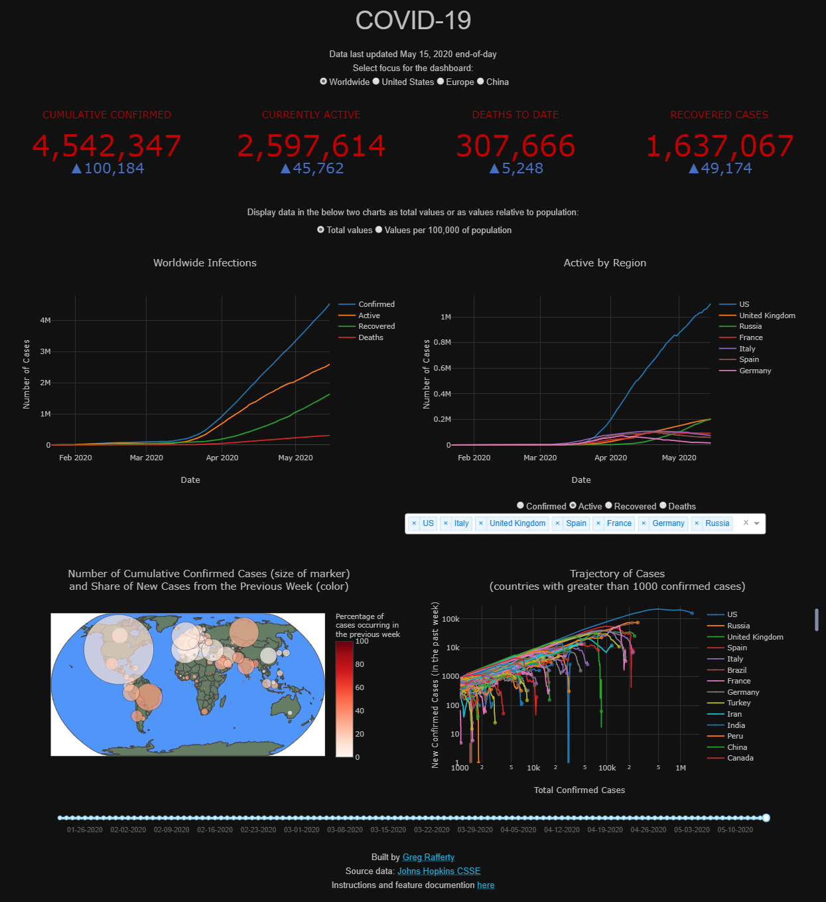
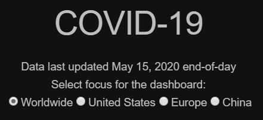
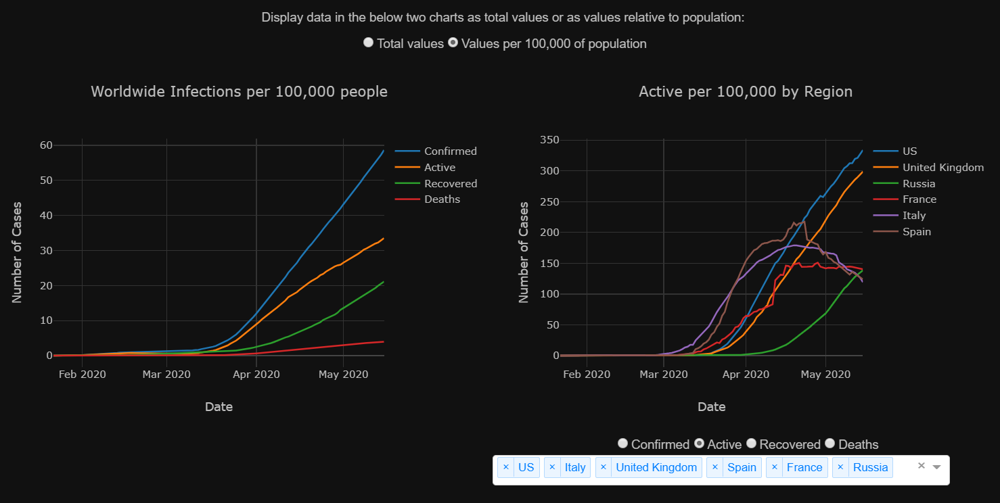
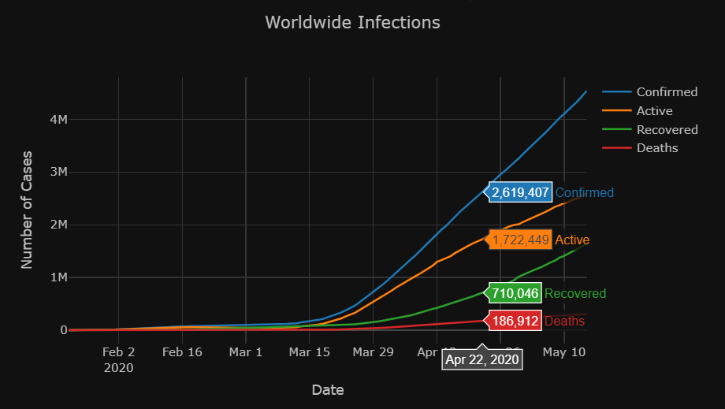
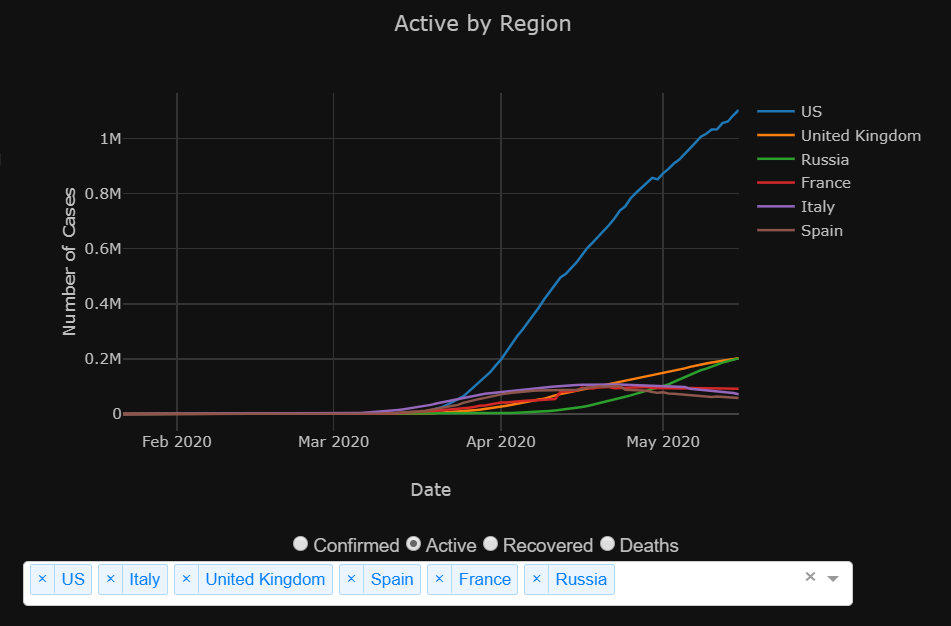

# COVID-19
A web dashboard deployed on Heroku at [https://covid-19-raffg.herokuapp.com/](https://covid-19-raffg.herokuapp.com/). Built in Python and [Dash](https://dash.plot.ly/), with charts made in [Plotly](https://plot.ly/). The data is provided by [Johns Hopkins Center for Systems Science and Engineering](https://github.com/CSSEGISandData/COVID-19) and automatically updates to the dashboard nightly.

 

 ---

 ## Focus selection

 The dashboard can be set on the pandemic globally, or with a focus on either the United States, Europe, or China through the radio buttons on the top:

 

 This button changes the underlying data for each displayed chart to reflect the selected region.

 Each evening at roughly 5pm Eastern time, Johns Hopkins updates their data source with new cases from the day. My dashboard automatically runs an ETL script to download the new data, process it into the format required by the dashboard, and upload it to Heroku. The headline here declares when the data was most recently updated.

 ---

 ## Components

There are five main components of the dashboard: the indicators, the infections rates for the selected region, the case analysis by sub-region, the infection map, and the trajectory chart.

### Indicators

There are four indicators, each consisting of the current value for the indicator, in red, and the change from yesterday, in blue for increasing values and green for decreasing.

- **CUMULATIVE CONFIRMED** is the running total of all cases tested and confirmed in the selected region. *(Note: This value is highly dependent upon the testing rate and almost certainly is an underestimate of actual infections.)*
- **CURRENTLY ACTIVE** measures only the cases active today.  
It is calculated as `ACTIVE = CONFIRMED - DEATHS - RECOVERED`
- **DEATHS TO DATE** measures the running total of all COVID-19-related deaths
- **RECOVERED CASES** is the number of cases in which the patient is deemed to have recovered from the illness and is no longer infected nor contagious.

### Regional charts

There are two regional charts, described below. These charts can display absolute infection numbers within the region, or numbers relative to the region's population. Selecting the radio button for `Values per 100,000 of population` normalizes each curve by population and can make it easier to compare the infection rates of regions with vastly different population counts. Selecting `Total values` returns the charts to absolute numbers.

#### Infections

The infections chart displays the totals for `CONFIRMED`, `ACTIVE`, `RECOVERED`, and `DEATHS` for the selected region, by date. Hovering the mouse over the chart will reveal the counts for each of these measures on the specific date. Using the mouse, you can zoom in and out or click and drag to select a box to zoom in on. Additionally, hovering over the chart (or any chart on the dashboard) will make visible several control buttons in the top right of the chart. There are slightly different options for each chart, but of particular usefulness is the ability to reset the chart back to original zoom level.

As with the other two line charts on this dashboard, clicking on an item in the legend will temporarily remove that item from the chart. Clicking again will add it back. Double-clicking an item will remove all other items and isolate that singular item on the chart. Double-clicking again will add back all items.

#### Cases by Sub-Region

The cases  graphic displays a line chart by sub-region of either `CONFIRMED`, `ACTIVE`, `RECOVERED`, or `DEATHS`, selectable with the radio buttons below the chart. If the selected region is `Worldwide` or `Europe`, the sub-regions displayed are countries. If the selected region is `United Sates` or `China`, the sub-regions are the states or provinces. On hover, the exact count of the selected metric is displayed for the sub-region the mouse is over.

By default, it displays sub-regions which were of particular interest when this dashboard was created. The dropdown-bar on the bottom allows you to select different sub-regions for display, either countries for the `Worldwide` or `Europe` focus or states/provinces for the `United States` or `China` focus. Typing in the dropdown-bar will allow you to search for sub-regions.

### Infection Map

The infection map features a circular marker over each sub-region. The size of the marker is relative to the square root of the `CONFIRMED` cases within that sub-region and the color indicates the percentage of those cases which were newly confirmed within the previous 7 days. Essentially, the size of the marker is a measure of how many people have caught the virus within that sub-region since the outbreak began and the color is a measure of how active the virus currently is, with dark red indicating the virus is actively spreading and white indicating that it is more under control. Hovering over a marker will reveal the country name and the exact value of the two measures. As with the other charts, the map is zoomable and dragable. Below the chart is a slider bar controlling the date at which the map displays data. By default it is set for the most recent date available but by dragging to the left you can see the spread of the pandemic through time.

### Trajectory

This chart displays the trajectory of the pandemic within sub-regions. The x-axis displays the cumulative confirmed count by sub-region and the y-axis displays the count of cases which were confirmed in the previous week. With this visualization, once a sub-region has managed to control the pandemic to some extent, the line should suddenly drop down, as China (green) and South Korea (orange) have in the image. Although `date` is not on either of the axes, the data is still plotted by date; hovering over any line will display the date on which that data point was recorded. Additionally, the date slider on the bottom also controls this chart; so along with the map, the progress throughout time of the trajectories can be inspected.